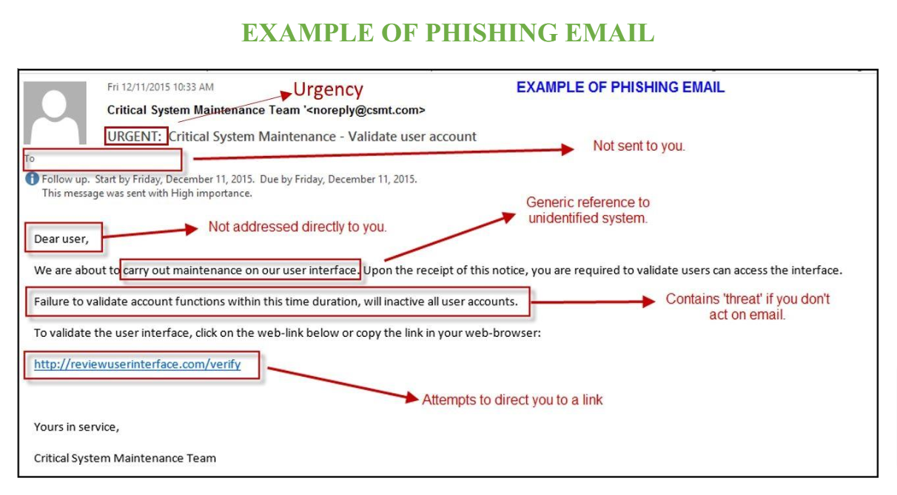
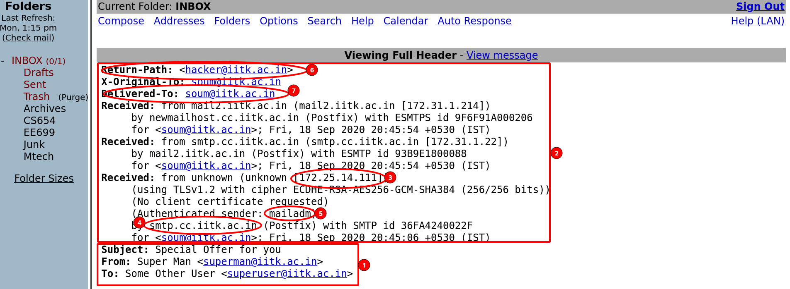

# Elevate-labs-Cybersecurity-Task-02
A repository for the task 02 from the Elevate labs, Cybersecurity

# Cyber Security Internship: Task 2 – Phishing Email Analysis

## Objective

Identify and document phishing characteristics in a suspicious email sample by examining both the message content and email header. This analysis fulfills requirements set by Elevate Labs and demonstrates proficiency in email threat detection [file:1].

---

## 1. Phishing Email Sample

**Key Indicators:**
- **Urgency:** "URGENT" in subject and message pushes the reader to act quickly.
- **Not Personally Addressed:** Uses "Dear user" instead of recipient’s name.
- **Generic Source Reference:** Refers to “Critical System Maintenance Team,” not a real organization.
- **Threatening Language:** Suggests account will be disabled if demands are not met.
- **Suspicious Link:** Prompts user to click an external URL (`reviewuserinterface.com/verify`) likely unrelated to any real service.

---

## 2. Email Header Analysis

**Key Findings:**
- **Return-Path Spoofing:** Return path set to `hacker@iitk.ac.in`, indicating sender spoofing.
- **Unknown/Untrusted Received-IP:** Email received from an unknown IP address (`172.25.14.111`), not matching official domain servers.
- **Generic Authenticated Sender:** "mailadm" as sender raises trust concerns.
- **Suspicious Subject/From:** Subject is classic phishing bait ("Special Offer for you"), and sender IDs (Super Man, Super User) are not official or verifiable contacts.
- **Mass Targeting Evidence:** Delivered-To field matches several generic users rather than personalized targets.

---

## 3. Phishing Indicators Detected

- Presence of urgent and threatening messages.
- Use of generic titles and sender identities.
- Mismatched or spoofed sender and reply-to addresses.
- IP addresses in the header revealing possible external senders.
- Suspicious web links not related to recognized domains.
- Social engineering tactics designed to create anxiety and compel action.
- Typical spelling or grammar mistakes.

---

## 4. Summary & Key Lessons

This analysis demonstrates how combining header inspection with content analysis reveals multiple phishing traits. Awareness of urgency, generic addresses, mismatched links, and technical header red flags enables successful detection. These best practices allow users and organizations to better protect against phishing—one of the most common forms of cyber attack [file:1].

---

## 5. Tools Used

- Webmail client (for accessing email and headers)
- Free online email header analyzer
- Visual markup and image annotation tools (for highlighting indicators)

---

## 6. Prevention Tips

- Never click links or download attachments from suspicious emails.
- Always verify sender and reply-to domains.
- Use “Show Original” or “View Source” in your mail client to inspect headers.
- Report suspected phishing emails to security teams.

---

**Report by:** Charitardha Pulipati  
**Internship:** Elevate Labs Cyber Security  
**Date:** October 22, 2025

